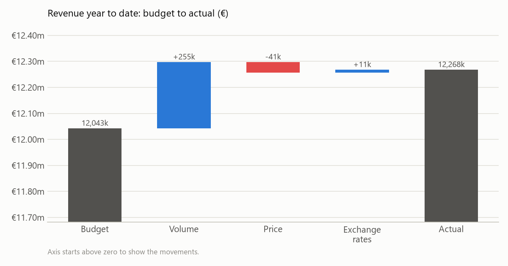
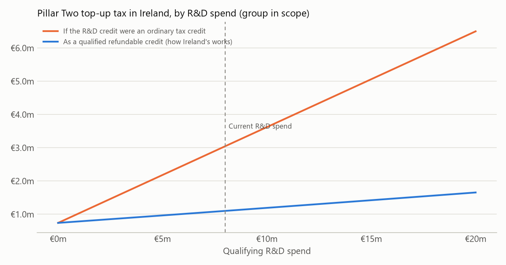
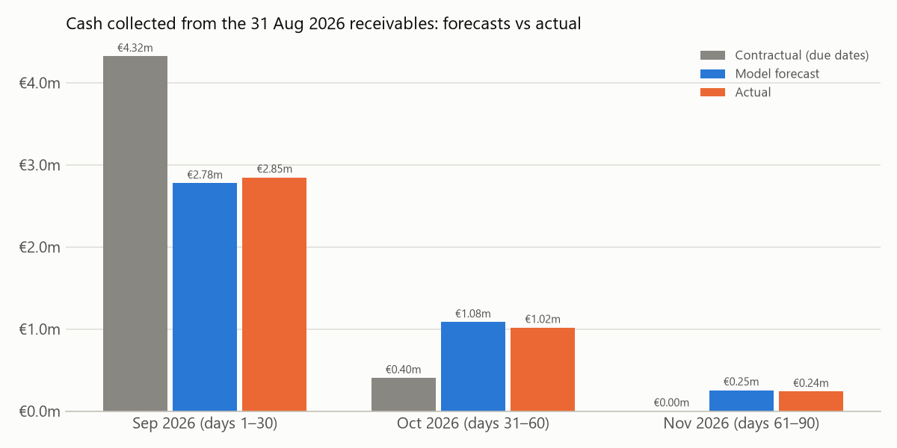

# Irish FP&A Portfolio

Four financial planning and analysis (FP&A) projects of the kind run in Irish finance teams: a month-end pipeline for a multinational's EMEA headquarters, SaaS recurring revenue metrics, Irish corporation tax under Pillar Two, and a receivables cash forecast. Each project has tests and a Streamlit app.

**The company data is simulated**, because no real company publishes its ledger. Each project says what is made up, what is real (ECB exchange rates and Irish tax rules), and what its results do and don't show. None of the results should be read as measured business impact.

| Project | What it does | Built with | Tests | Live app |
|---|---|---|---:|---|
| [Month-end FP&A pipeline](fpa_reporting_pipeline/) | GL export → data checks → EUR at ECB rates → budget vs actual → volume/price/FX bridge → headcount bridge → 12-month rolling forecast → written commentary → PowerPoint board pack | pandas, ECB API, python-pptx | 12 | [Open](https://irish-fpa-month-end-pipeline.streamlit.app/) |
| [SaaS metrics](saas_metrics/) | MRR bridge, cohort retention, NRR/GRR, CAC/LTV/payback, IFRS 15 deferred revenue, 36-month scenario model with cash runway | SQL (DuckDB), pandas | 9 | [Open](https://irish-fpa-saas-metrics.streamlit.app/) |
| [Irish corporation tax](irish_corporation_tax/) | Corporation tax, 35% R&D credit and its instalments, preliminary tax, Pillar Two top-up tax, three-year tax charge, cash and balance sheet | Python, Revenue guidance | 13 | [Open](https://irish-fpa-corporation-tax.streamlit.app/) |
| [Receivables and cash forecast](ar_cash_forecast/) | Ageing, DSO, late-payment risk model, survival-based cash collection forecast, backtested against actual collections | scikit-learn, pandas | 9 | [Open](https://irish-fpa-receivables.streamlit.app/) |

The apps are hosted free on Streamlit Community Cloud and go to sleep when unused, so the first visit can take up to a minute to wake one up.

## Highlights

### Month-end pipeline: the revenue variance explained



The pipeline splits the revenue variance into volume, price and exchange-rate effects that add up exactly. From the ledger alone, it identified every story built into the simulated data: EU discounting, a large USD deal, R&D hiring running three people behind, and two data errors. [More](fpa_reporting_pipeline/)

### SaaS metrics: retention by cohort


The MRR bridge, retention and cohort tables are written in SQL. The cohort view shows annual renewals as clear steps at months 12 and 24. [More](saas_metrics/)

### Corporation tax: why Ireland pays its R&D credit in cash



Because the credit is paid out in cash, the Pillar Two rules treat it as income rather than as a reduction in tax. For the example company that means €1.10m of top-up tax instead of €3.04m. [More](irish_corporation_tax/)

### Receivables: a forecast that was checked against what happened



Assuming every invoice is paid on its due date overstated September collections by €1.5m. The behaviour-based forecast came within 3%. The README also covers the model's first version, which missed customers whose payment behaviour changed, and how that was fixed. [More](ar_cash_forecast/)

## Running it

Tested with Python 3.13.

```bash
pip install -r requirements.txt
cd fpa_reporting_pipeline && py -m unittest -v    # likewise in each project folder
```

Run the apps from the repository root:

```bash
py -m streamlit run fpa_reporting_pipeline/app.py
```

The other apps are `saas_metrics/app.py`, `irish_corporation_tax/app.py` and `ar_cash_forecast/app.py`. The hosted versions run on Python 3.13 on [Streamlit Community Cloud](https://streamlit.io/cloud) and redeploy on every push to `main`.

Every push runs all four projects' tests on GitHub Actions ([`.github/workflows/tests.yml`](.github/workflows/tests.yml)).

## How this was built

Built with AI assistance (Claude Code). Each project's README states what its code covers, what it leaves out, and where its rules come from.
