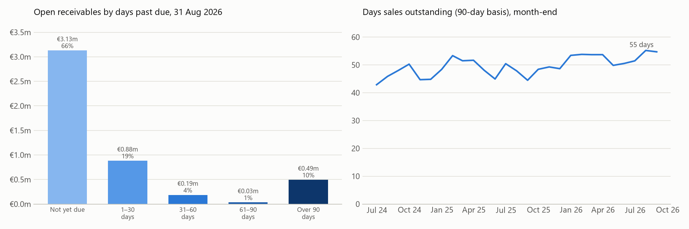
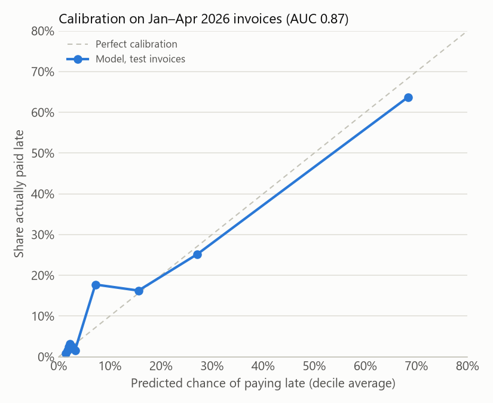

# Receivables: ageing, late-payment risk and a cash collection forecast

For a company's receivables at month-end, this project:
- ages the open invoices and tracks days sales outstanding (DSO),
- scores each open invoice for the chance of being paid more than 30 days late,
- turns those scores into a forecast of cash collected in each of the next three months.

It then **backtests** that forecast against what was actually collected, and compares it with the usual shortcut of assuming invoices are paid on their due dates.

**The data is simulated.** Example Distribution Ltd is a fictional Irish food and drink distributor with 150 trade customers and 9,440 invoices from January 2024 to 31 August 2026. [`generate_data.py`](generate_data.py) gives customers hidden payment habits: reliable, slow or risky. It also makes five reliable customers start paying late from March 2026. The ledger (`data/invoices.csv`) shows only what was known on 31 August. What happened afterwards is kept in a separate file and used only for the backtest.

A model trained on simulated data is learning rules that the simulation built in, so the model's accuracy here says nothing about real customers. What the project demonstrates is the method: no look-ahead, a time-based test, a calibration check and a backtest.

```bash
py generate_data.py        # recreate the simulated ledger
py ar.py                   # print ageing, model evaluation and the backtest
py charts.py               # redraw the charts
py -m unittest -v          # 9 tests
cd .. && py -m streamlit run ar_cash_forecast/app.py
```

## Receivables at 31 August 2026



| Days past due | Amount | Share |
|---|---:|---:|
| Not yet due | €3.13m | 66% |
| 1–30 days | €0.88m | 19% |
| 31–60 days | €0.19m | 4% |
| 61–90 days | €0.03m | 1% |
| Over 90 days | €0.49m | 10% |
| **Total** | **€4.72m** | |

DSO is 55 days, measured as receivables ÷ the last 90 days' credit sales × 90. It has drifted up from the low 40s in mid-2024. The €0.49m over 90 days is mostly invoices that will never be paid. In real accounts it would carry an IFRS 9 expected credit loss provision, which would be a natural next step for this project.

## Late-payment risk model

**Target:** an invoice is "late" if it is paid more than 30 days after its due date, or not at all.

**Features:** only what was known on the day each invoice was raised.

| Feature | Meaning |
|---|---|
| `late_rate` | Share of the customer's invoices from the last 180 days that were known to be late |
| `mean_days_late` | Average days after the due date the customer paid, last 180 days |
| `history` | Number of the customer's past invoices with a known outcome |
| `log_amount`, `amount_vs_usual` | Invoice size, overall and against the customer's usual invoice |
| `december` | Christmas slows payment |

An invoice counts as known-late as soon as it is 30 days overdue, even if it hasn't been paid yet. A test builds a small ledger by hand to confirm that nothing from after an invoice's date leaks into its features.

**Train and test by time, not at random:**
- **Training:** logistic regression fitted on 5,312 invoices issued July 2024 to December 2025.
- **Testing:** scored on 1,234 invoices issued January to April 2026, all of whose outcomes were known by the cut-off.

A random split would let the model learn from a customer's 2026 invoices and then be "tested" on their 2025 ones.

| | Model | Customer's recent late rate alone |
|---|---:|---:|
| AUC (1 = perfect ranking, 0.5 = chance) | **0.869** | 0.831 |
| Brier score (lower is better) | 0.081 | |
| Share of test invoices actually late | 13.5% | |



Calibration checks whether the predictions can be used as probabilities, which the cash forecast depends on. Invoices given a 68% chance of being late were late 64% of the time; those given 2–3% were late 2–3% of the time.

### What the first version got wrong

The first version measured each customer's behaviour over their **whole history**. It scored slightly higher on the test (AUC 0.876), but it missed the five customers who started paying late in March 2026. It gave all five a 1–2% chance of paying late, because two years of prompt payment outweighed five months of late payment. Adding a 180-day late rate alongside the lifetime one didn't fix it either. Nobody deteriorated during the training period, so the recent rate never told the model anything new, and it learned to ignore it.

The current version measures behaviour over **the last 180 days only**, falling back to lifetime history when there's no recent record. It gives those five customers a 51–60% chance of paying late and ranks them 3rd, 8th, 14th, 23rd and 29th of the 134 customers with open balances. Trading a little test accuracy for catching customers whose behaviour changes is the right trade for credit control. To reproduce the first version, set `RECENT` to a very large number.

## Cash collection forecast, and backtest

Each open invoice is placed in a risk band from its score:

| Band | Chance of paying late | Open invoices | Amount |
|---|---|---:|---:|
| Low | under 15% | 313 | €2.84m |
| Medium | 15–50% | 100 | €1.06m |
| High | over 50% | 69 | €0.83m |

For each band, history gives a distribution F of how many days after the due date invoices were paid, with never-paid invoices treated as never. An open invoice that is already d days past due and still unpaid has a chance of being paid between day d+a and day d+b of **(F(d+b) − F(d+a)) ÷ (1 − F(d))**. This is a survival calculation: an invoice that has already gone unpaid for 60 days is judged against invoices that also lasted 60 days, not against all invoices.


| Collected from the 31 August receivables | Contractual (due dates) | Model forecast | Actual |
|---|---:|---:|---:|
| September (days 1–30) | €4.32m | €2.78m | €2.85m |
| October (days 31–60) | €0.40m | €1.08m | €1.02m |
| November (days 61–90) | €0.00m | €0.25m | €0.24m |

The due-date method assumes every overdue invoice is paid immediately, which overstates September by €1.5m. The behaviour-based forecast is within 3% for September and 7% for October.

## Limitations

- **Simulated behaviour:** payment habits follow the rules in `generate_data.py`. Real payment behaviour also depends on disputes, credit holds and who chases the debt.
- **No write-offs, credit notes or partial payments** in the ledger.
- **Risk bands use fixed cut-offs** (15% and 50%). The forecast could instead use each invoice's own score directly.
