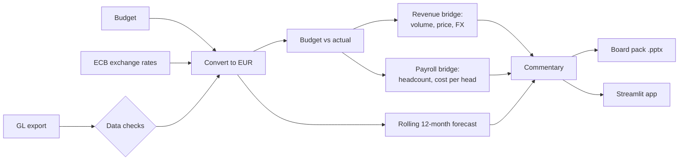
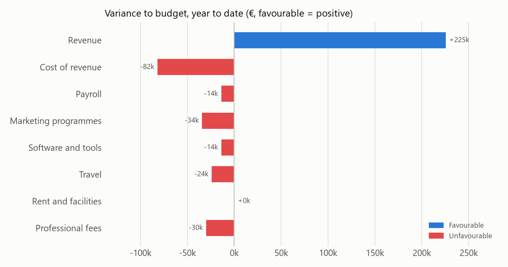
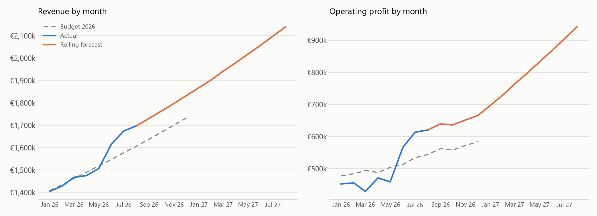

# Month-end FP&A pipeline: from general ledger to board pack

**Live app:** https://irish-fpa-month-end-pipeline.streamlit.app/ (it may take up to a minute to wake up)

One command takes a raw general ledger (GL) export and the budget. It checks the data, converts every currency to euro, compares actuals with budget, and explains the revenue and payroll variances. It then rolls a 12-month forecast forward, writes the commentary, and builds a seven-slide PowerPoint board pack. A Streamlit app shows the same results interactively.

**The data is simulated.** Example Software EMEA Ltd is a fictional Dublin-based EMEA headquarters billing customers in euro, sterling and dollars. [`generate_data.py`](generate_data.py) creates its budget and eight months of GL postings, with some deliberate stories and two deliberate data errors for the pipeline to find. Only the exchange rates are real: ECB monthly averages.



## The problem

Month-end in a multi-currency business involves a lot of mechanical work before any analysis:
- Clean the ledger export.
- Convert each currency at the right rate.
- Compare against a budget set at different rates.
- Work out how much of each variance is volume, price or exchange rates.

The pipeline does that part the same way every month and flags anything it had to fix. That leaves the analyst's time for the question the numbers can't answer: *why*.

## Results for August 2026 (simulated data)




The commentary the pipeline wrote:

> - In August, operating profit was €620k, €76k ahead of budget.
> - Year to date to August 2026, operating profit is €4.06m, €28k (0.7%) ahead of budget.
> - Revenue is +€225k against budget: volume +€255k, price −€41k, exchange rates +€11k.
> - EUR revenue: volume +€118k, price −€79k.
> - GBP revenue: volume −€80k.
> - USD revenue: volume +€217k, price +€39k.
> - Cost of revenue is €82k (7%) over budget.
> - Marketing programmes is €34k (6%) over budget.
> - Professional fees is €30k (37%) over budget.
> - R&D: 3 heads under budget (+€142k year to date).
> - Sales: 1 head over budget (−€47k year to date).
> - Pay per head is running above budget across departments (−€109k year to date).
> - Full-year outlook: operating profit €6.66m against a budget of €6.31m (+€344k), using actuals to August and the rolling forecast after.
> - Data check (warning): duplicate postings, 1 repeated posting removed: JE100157.
> - Data check (warning): missing cost centre, 1 line posted to UNALLOCATED: JE100156.

Each line matches a story built into the simulated data:
- **EU:** seats are growing faster than budget, but the price was cut from €55 to €54 in April.
- **UK:** growth is slower than budget.
- **USD:** a 1,400-seat deal was signed in June, and prices rose 4% in July.
- **R&D:** hiring is running three people behind plan.
- **Pay:** the pay review came in 2% above budget.
- **Professional fees:** a one-off legal bill landed in May.

The pipeline wasn't told any of this. It recovered each story from the ledger.



## Method

### Exchange rates

Actuals are converted at each month's ECB average rate, and the budget at fixed budget rates (USD 1.16, GBP 0.87, set at October 2025 levels). This keeps currency movements out of the volume and price effects and shows them separately.

### Revenue bridge

For each currency and month, with seats V, local price P and rate R (currency per euro), for budget (b) and actual (a):

| Effect | Formula | Meaning |
|---|---|---|
| Volume | (Va − Vb) × Pb ÷ Rb | Extra or missing seats, at budget price and rate |
| Price | Va × (Pa − Pb) ÷ Rb | Price change on the seats actually sold, at budget rate |
| FX | Va × Pa × (1/Ra − 1/Rb) | Actual revenue converted at actual rather than budget rate |

The three effects add up exactly to actual revenue minus budget revenue. The tests check this both on a hand-worked example and on the full data.

### Payroll bridge

| Effect | Formula |
|---|---|
| Headcount | −(actual heads − budget heads) × budget cost per head |
| Cost per head | −actual heads × (actual − budget cost per head) |

Payroll includes employer PRSI at 11.25%, rising to 11.40% from 1 October 2026 (the rate for pay above €552 a week). The forecast picks this rise up.

### Rolling forecast

| Line | Method |
|---|---|
| Revenue | Seats grow at the median of the last three month-on-month growth rates. Price and exchange rate are held at the latest month's |
| Hosting | Latest cost per seat × forecast seats |
| Payroll | Latest heads plus the hires still in the budget, at the latest cost per head, plus employer PRSI |
| Other costs | Average of the last three months |

The median is used so that a one-off jump, like June's USD deal, isn't treated as a trend (there's a test for this). The main limitation: compounding recent growth for 12 months is optimistic, and it shows in the chart. A real forecast would add the sales pipeline, churn and seasonality.

### Commentary

The commentary is rule-based. A variance is mentioned only if it is at least €25k and 5% (adjustable in the app), and every sentence is built from a number in the results. An AI model could write more fluent prose, but it could also make up a reason. These rules state *what* moved and by how much; the *why* has to come from the business.

### Data checks

| Check | Action |
|---|---|
| Duplicate transaction IDs | Removed, reported as a warning |
| Missing cost centre | Posted to UNALLOCATED, reported as a warning |
| Unknown cost centre | Error: the run stops |
| Account not in the chart of accounts | Error: the run stops |
| No exchange rate for a currency and month | Error: the run stops |

## Running it

From the repository root:

```bash
pip install -r requirements.txt
cd fpa_reporting_pipeline
py generate_data.py            # recreate the simulated budget and ledger
py pipeline.py --refresh-fx    # download ECB rates, print the results
py board_pack.py               # write output/board_pack_2026-08.pptx and the charts
py -m unittest -v              # 12 tests, including the Streamlit app for every month
cd ..
py -m streamlit run fpa_reporting_pipeline/app.py
```

| File | What it holds |
|---|---|
| `pipeline.py` | Data checks, conversion, budget vs actual, bridges, forecast, commentary |
| `charts.py` | The three charts, shared by the pack, the app and this README |
| `board_pack.py` | The PowerPoint pack |
| `app.py` | The Streamlit app |
| `generate_data.py` | The simulated budget and ledger |
| `data/` | Chart of accounts, cost centres, budget rates, ECB rates, budget and ledger |
