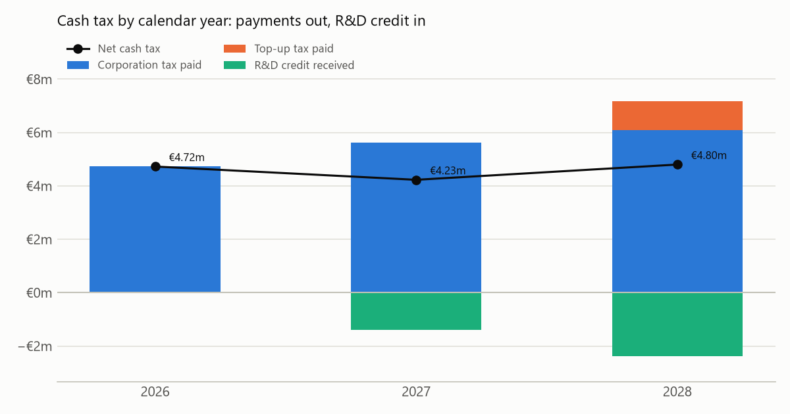

# Irish corporation tax: the R&D credit and Pillar Two

A tax planning model for an Irish company in a large multinational group. For the 2026 year it works out:
- corporation tax,
- the R&D tax credit and how it is paid in instalments,
- preliminary tax timing,
- a simplified Pillar Two top-up tax.

It then projects three years, linking the tax charge in the P&L, cash tax paid, and tax balances on the balance sheet. A Streamlit app lets you change every input.

**This is an illustrative model, not tax advice.** The rules come from Revenue's guidance and were checked on 27 September 2026 (see [`rules_2026.json`](rules_2026.json)). The Pillar Two part is deliberately simplified (see the limitations below). The example company is made up.

```bash
py ct_model.py             # the example company
py charts.py               # redraw the charts
py -m unittest -v          # 13 tests, including Revenue's worked examples
cd .. && py -m streamlit run irish_corporation_tax/app.py
```

## The rules used

| Rule | 2026 value | Source |
|---|---|---|
| Corporation tax | 12.5% on trading income; 25% on non-trading income (e.g. interest, rent) | [Revenue](https://www.revenue.ie/en/companies-and-charities/corporation-tax-for-companies/corporation-tax/basis-of-charge.aspx) |
| R&D tax credit | 35% of qualifying spend, for years ending 31 December 2026 or later (30% before) | [Tax and Duty Manual 29-02-03](https://www.revenue.ie/en/tax-professionals/tdm/income-tax-capital-gains-tax-corporation-tax/part-29/29-02-03.pdf), April 2026 |
| R&D credit instalments | First: the greater of €87,500 (or the whole credit, if smaller) and 50% of the credit. Second: 3/5 of what's left. Third: the rest | Same, section 2.3.1 |
| Preliminary tax | Large companies (prior-year tax over €200,000): 45% of this year's or 50% of last year's liability in month 6, then up to 90% of this year's in month 11. Balance with the return, nine months after year-end | [Revenue](https://www.revenue.ie/en/companies-and-charities/corporation-tax-for-companies/corporation-tax-payment-and-filing/preliminary-ct.aspx) |
| Pillar Two | 15% minimum effective rate for groups with revenue of €750m or more; carve-outs in 2026 of 9.4% of payroll and 7.4% of tangible assets | OECD GloBE rules, Article 9.2; Ireland's domestic top-up tax |

Revenue's four worked examples of R&D instalments (examples 4 to 7 in the Tax and Duty Manual) are among the tests.

## The example company, 2026

| Input | Amount |
|---|---:|
| Trading profit (before the R&D credit) | €40.0m |
| Interest income | €1.0m |
| Qualifying R&D spend | €8.0m |
| Irish payroll | €30.0m |
| Irish tangible assets | €60.0m |
| Group revenue | Over €750m |

| Result | Amount |
|---|---:|
| Corporation tax: 12.5% × €40m + 25% × €1m | €5.25m |
| R&D credit: 35% × €8m | €2.80m |
| Paid as three instalments | €1.40m, €0.84m, €0.56m |
| Tax after the R&D credit | €2.45m (6.0% of profit) |
| Preliminary tax, June and November | €2.36m each |
| Balance with the return, September 2027 | €0.53m |

## Pillar Two: why Ireland's R&D credit is paid in cash

Under the global minimum tax (Pillar Two), a large group pays a **top-up tax** wherever its effective tax rate in a country is below 15%. Ireland collects that top-up itself through a domestic minimum tax.

The effective rate here is **covered taxes ÷ GloBE income**. How the R&D credit is treated changes both parts:
- **Ordinary tax credit:** it cuts covered taxes, so the effective rate falls.
- **Qualified refundable tax credit:** a credit that must be paid in cash within four years counts as *income* instead, and covered taxes aren't reduced.

Finance Act 2022 changed Ireland's R&D credit so that any amount not used against tax is always paid out in cash over three years. That lets it qualify.

| | Qualified refundable credit (Ireland's) | If it were an ordinary credit |
|---|---:|---:|
| Covered taxes | €5.25m | €5.25m − €2.80m = €2.45m |
| GloBE income | €41.0m + €2.8m = €43.8m | €41.0m |
| **Effective tax rate** | **11.99%** | **5.98%** |
| Top-up rate (15% − rate) | 3.01% | 9.02% |
| Carve-out: 9.4% × payroll + 7.4% × tangible assets | €7.26m | €7.26m |
| Excess profit (income − carve-out) | €36.54m | €33.74m |
| **Top-up tax** | **€1.10m** | **€3.04m** |


With no R&D at all, the company's rate is 12.8%: 12.5% on trading income, pulled up by the 25% rate on interest. Its top-up tax would then be €0.74m. Each extra euro of R&D adds much less top-up tax when the credit is treated as income than it would as an ordinary credit. That is why Ireland designed it to qualify.

## Three years: P&L, cash and balance sheet



| | 2026 | 2027 | 2028 |
|---|---:|---:|---:|
| Profit before tax (incl. R&D credit) | €43.8m | €47.4m | €51.2m |
| Tax charge (corporation tax + top-up tax) | €6.35m | €6.88m | €7.45m |
| Corporation tax paid | €4.73m | €5.63m | €6.08m |
| Top-up tax paid | – | – | €1.10m |
| R&D credit received | – | €1.40m | €2.38m |
| **Net cash tax** | **€4.73m** | **€4.23m** | **€4.80m** |
| Tax payable at year-end | €1.63m | €2.88m | €3.14m |
| R&D credit receivable at year-end | €2.80m | €4.48m | €5.49m |

Profit grows 8% a year, and R&D spend 10% a year. The three statements are linked like this:
- **P&L:** the tax charge is corporation tax plus top-up tax for the year. The R&D credit is shown *above the line*, as a reduction of R&D costs. Many Irish companies present it this way, because the credit is paid whether or not the company has taxable profits.
- **Cash:** each calendar year pays that year's preliminary tax and last year's balance. It receives R&D instalments from earlier claims, and pays top-up tax about 15 months after the year it relates to.
- **Balance sheet:** tax payable = charges to date − payments to date. The R&D receivable = credits claimed − instalments received. A test checks both roll-forwards.

The effective rate in the P&L is 14.5%. That is below 15% because the substance carve-out shelters part of the profit from top-up tax.

## Limitations

- **Taxable profit equals accounting profit.** There are no capital allowances, losses, group relief, Knowledge Development Box or deferred tax.
- **Pillar Two is a single-company, single-year calculation.** It leaves out the transitional safe harbours, the 2026 side-by-side package, deferred tax in covered taxes, and blending with other group companies in Ireland. Real top-up tax could differ materially.
- **Timing is approximate.** Due dates are shown to the month (preliminary tax and returns are actually due on the 23rd), and top-up tax is assumed to be paid 15 months after the year-end.
