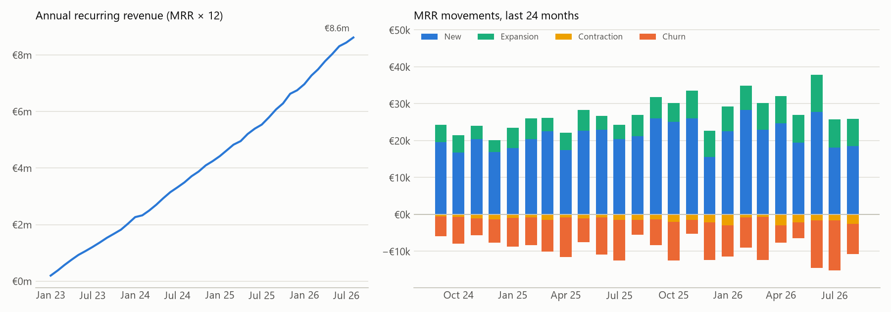
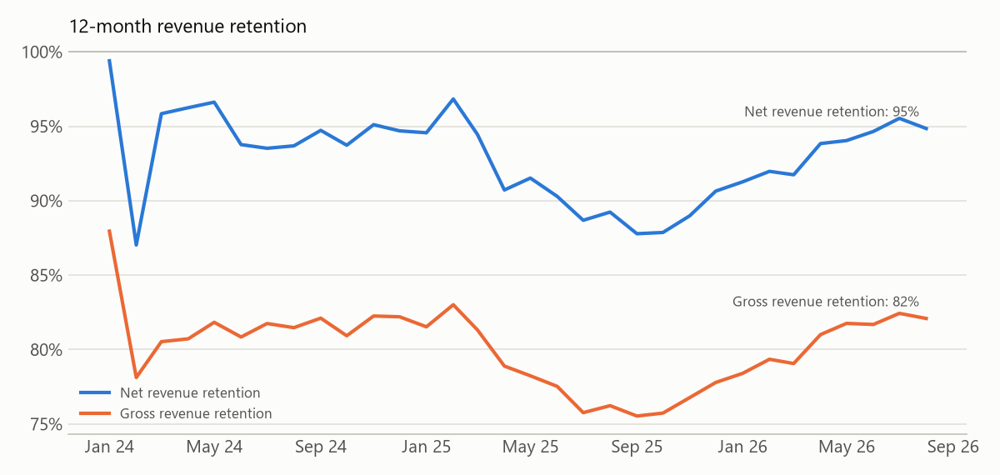
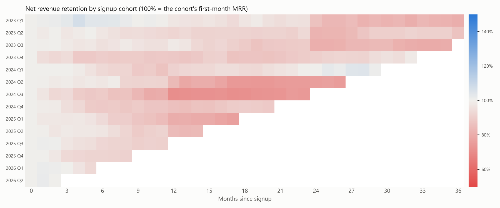
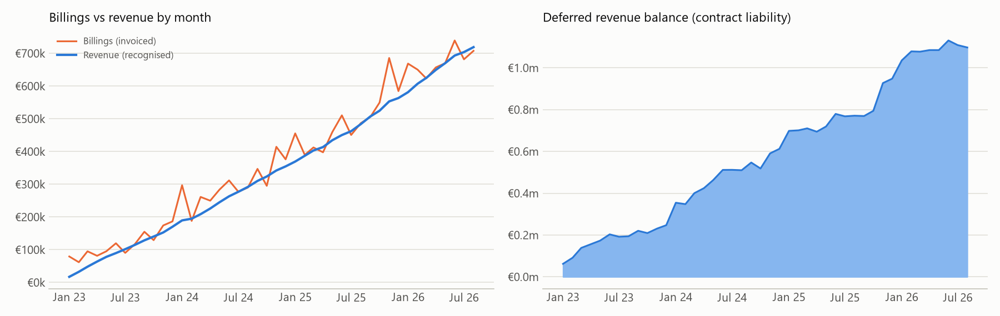
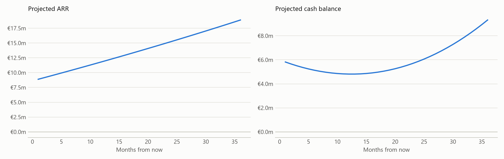

# SaaS metrics: recurring revenue, retention, unit economics and IFRS 15

Calculates the metrics a software company's FP&A team reports every month:
- monthly recurring revenue (MRR) and annual recurring revenue (ARR),
- the MRR bridge,
- cohort retention and net and gross revenue retention (NRR and GRR),
- customer acquisition cost (CAC), lifetime value (LTV) and CAC payback,
- deferred revenue under IFRS 15.

A Streamlit app adds a 36-month scenario model with cash runway. The core metrics are written in **SQL** and run in DuckDB. The unit economics and scenario model are in Python.

**The data is simulated.** Example SaaS Ltd is a fictional Dublin B2B software company. [`generate_data.py`](generate_data.py) creates 1,548 customers signing up between January 2023 and August 2026, with realistic churn, expansion and contraction. 30% pay annually in advance.

```bash
py generate_data.py        # recreate the simulated customers
py metrics.py              # print the metrics
py charts.py               # redraw the charts
py -m unittest -v          # 9 tests
cd .. && py -m streamlit run saas_metrics/app.py
```

## Headline numbers, August 2026

| Metric | Value | Definition |
|---|---:|---|
| ARR | €8.62m | MRR × 12 |
| Customers | 1,149 | Paying in August 2026 |
| ARPA | €625 a month | Average revenue per account: MRR ÷ customers |
| Net revenue retention | 95% | MRR now from customers who were paying 12 months ago ÷ what they paid then |
| Gross revenue retention | 82% | The same, but no customer counted above their earlier MRR |
| Monthly logo churn | 1.5% | Customers lost ÷ customers at the start of the month, 12-month average |
| CAC | €7,410 | Sales and marketing spend ÷ new customers, last 3 months |
| LTV | €32,856 | ARPA × gross margin (78%) ÷ monthly churn |
| LTV to CAC | 4.4x | Common rule of thumb: above 3x |
| CAC payback | 15 months | CAC ÷ (ARPA × gross margin) |

## Growth and the MRR bridge



Every month's MRR change splits into four parts: **opening + new + expansion + contraction + churn = closing**. [`sql/mrr_bridge.sql`](sql/mrr_bridge.sql) does this in one query:
1. It builds a row for every customer in every month since they signed up, with MRR 0 after they leave.
2. It uses `LAG()` to compare each month with the one before.

A test checks that the bridge adds up in every month and that its closing MRR matches a plain total of the subscriptions table.

## Retention



NRR of 95% means that the customers the company had a year ago now pay 95% of what they paid then. Expansion from some didn't quite make up for churn and downgrades from others. GRR (82%) leaves expansion out, so it shows the underlying leak. The gap between the two, 13 points, is what expansion is contributing.



| Cohort | Month 3 | Month 6 | Month 12 | Month 24 |
|---|---:|---:|---:|---:|
| 2023 Q1 | 103% | 104% | 98% | 87% |
| 2023 Q3 | 98% | 96% | 98% | 81% |
| 2024 Q1 | 100% | 93% | 91% | 100% |
| 2024 Q3 | 94% | 89% | 71% | |
| 2025 Q1 | 97% | 94% | 80% | |
| 2025 Q3 | 97% | 93% | | |

Each row follows one quarter's signups. Cells only appear once every customer in the cohort has reached that month; otherwise late-quarter signups would make recent cohorts look better than they are. The colour steps at months 12 and 24 are **annual renewals**: annual payers can only leave at the end of their contract year, so their churn arrives all at once. The 2024 Q3 cohort lost 29% of its revenue by month 12, which would be the first cohort to investigate.

## Revenue recognition (IFRS 15)



Billing and revenue aren't the same thing for a subscription business.
- **Monthly payers** are invoiced each month for that month, so billings equal revenue.
- **Annual payers** are invoiced 12 months in advance, at signup and at each renewal. Under IFRS 15 the service is delivered over time, so revenue is recognised one month at a time as it's provided.

The billed-but-not-yet-earned amount is a **contract liability** (deferred revenue) on the balance sheet. It builds up when annual invoices go out and unwinds month by month. For Example SaaS it stood at €1.10m in August 2026. The code assumes invoices are payable when issued. Under IFRS 15 the liability arises when payment is received or due, whichever comes first.

A hand-worked test: one annual customer at €100 a month is billed €1,200 in January. €100 is recognised each month, so deferred revenue is €1,100 after January and zero after December.

## Scenario model



The app projects 36 months forward. By default it uses the latest actuals: new customers per month, logo churn, net expansion and CAC. Sliders change each input, and the app shows ARR at 36 months, the month cash flow turns positive, and the month cash runs out, if it does.

Cash in the bank (€6m) and costs other than sales and marketing (€450k a month, growing 0.5% a month) aren't in the data; they are stated assumptions.

| Scenario | ARR in 36 months | Lowest cash balance | Cash-flow breakeven |
|---|---:|---:|---:|
| Base case (recent actuals) | €18.9m | €4.8m | Month 13 |
| Monthly churn doubles to 3% | €13.4m | €3.0m | Month 32 |
| Half as many new customers | €12.9m | €5.8m | Month 10 |
| Churn 3%, starting with €3m cash | €13.4m | Runs out in month 28 | Month 32 |

Halving new customers makes the company cash-positive *sooner*, because acquisition spend falls with it, but ARR ends up a third lower. That's the growth-versus-cash trade-off the model is built to show.

## Limitations

- **Churn is modelled at customer level** and applied to average revenue, so it assumes churning customers are average-sized.
- **The gross margin of 78% is an assumption**, not calculated from cost data.
- **CAC is blended across channels.** The data records each customer's channel, but not spend by channel.
- **Sales and marketing are treated as pure acquisition cost** in CAC, which overstates it slightly.
